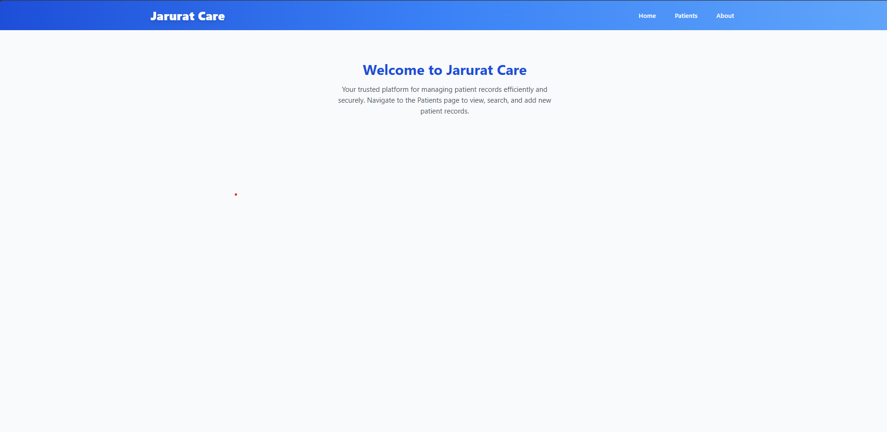
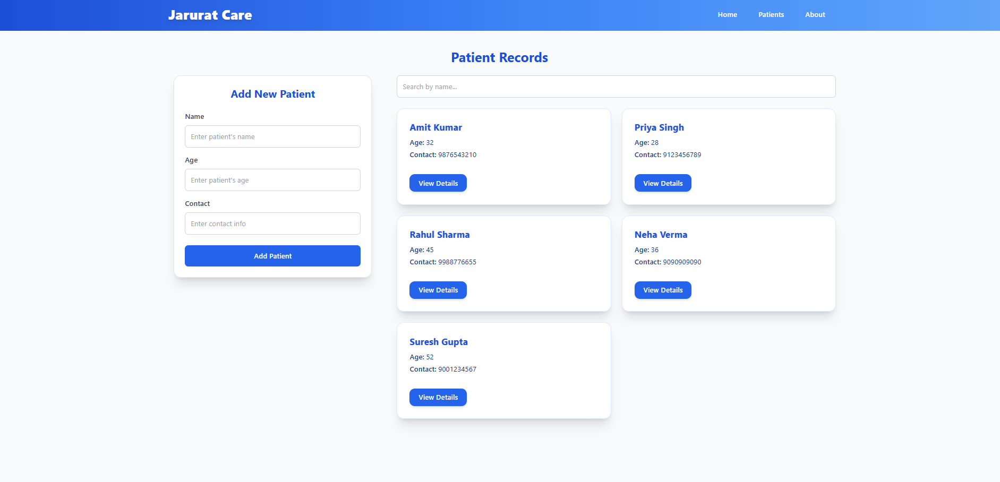

 ------ Set Up Instructions ---------
git clone https://github.com/Ankush00007/Patient-Records-Platform.git
 
cd Patient-Records-Platform
 
npm install
 
npm start
 
http://localhost:3000
 

 ----- Screenshots --------
  

